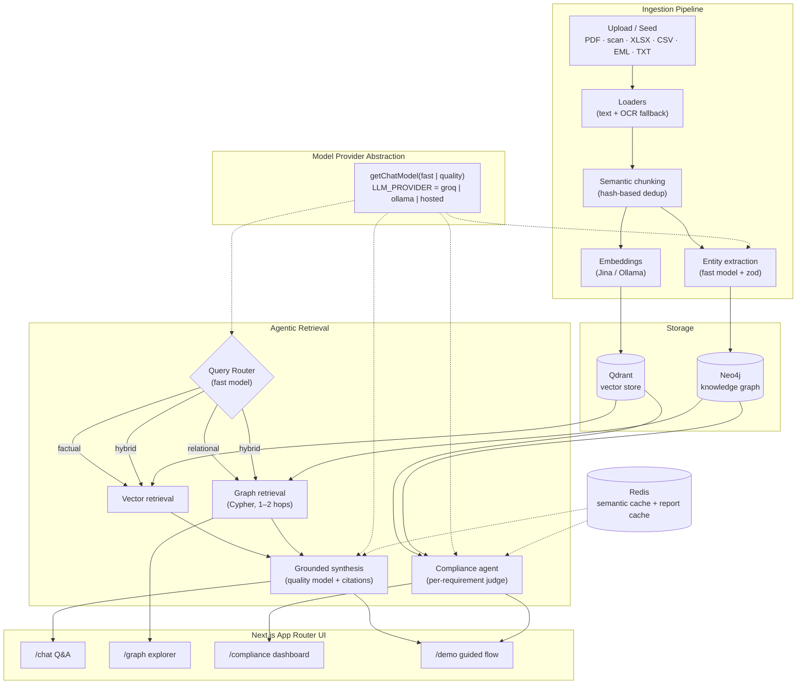

# IKI Architecture

Industrial Knowledge Intelligence (IKI) turns heterogeneous plant documents into a
queryable knowledge system with three retrieval surfaces — cited question-answering,
a knowledge graph, and a compliance auditor — over a shared corpus.

## System diagram

## Components

| Layer | Responsibility | Key modules |
| --- | --- | --- |
| Ingestion | Parse any document, OCR scans, chunk, extract entities, embed | `src/lib/ingest/*` |
| Vector store | Cosine similarity search over 768-d embeddings | Qdrant, `src/lib/rag/retrieve.ts` |
| Knowledge graph | Documents, Equipment, RegulatoryRef, Person, Parameter and their relationships | Neo4j, `src/lib/graph/*` |
| Router | Classify each query as factual / relational / hybrid | `src/lib/rag/router.ts` |
| Synthesis | Grounded answer with inline `[n]` citations + confidence | `src/lib/rag/answer.ts` |
| Compliance agent | Judge each requirement vs. evidence, conservatively | `src/lib/agents/compliance.ts` |
| Provider abstraction | One seam for every LLM call | `src/lib/ai/provider.ts` |

## Model provider abstraction & data sovereignty

Every model call goes through `getChatModel("fast" | "quality")` and every embedding
through `src/lib/ai/embeddings.ts`. No route or agent imports a provider SDK directly.

Because of that single seam, the deployment target is an environment variable:

- `LLM_PROVIDER=groq` — hosted open models (Llama 3.1/3.3) for the fastest demo path.
- `LLM_PROVIDER=ollama` — fully **on-prem open models** for data residency. The same
  code runs against a local Ollama or vLLM endpoint with **zero code changes** —
  documents never leave the plant network.
- `LLM_PROVIDER=hosted` — any OpenAI-compatible endpoint (private cloud, regional).

This matters for industrial customers: process data, incident records and compliance
evidence are sensitive. IKI can run entirely inside the customer's perimeter while
keeping the identical retrieval, graph, and compliance logic.

See [SCALABILITY.md](./SCALABILITY.md) for throughput, multi-tenancy, and cost notes.
